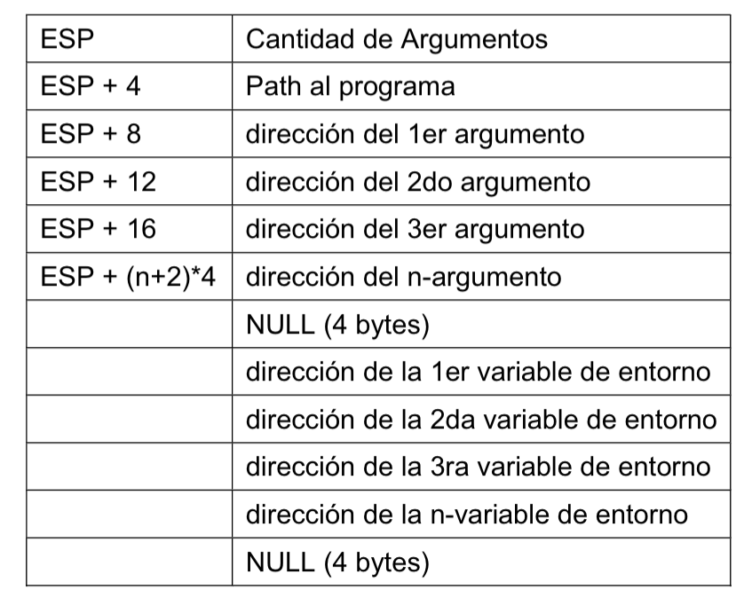

# Assembly

## Registros


Tambien están de R8 - R12

## Stack

cuando se monta un programa el stack esta de la siguiente manera



las direcciones que estan mas abajo son mayores

## Compilación y linkedición

En 32 bits:

````bash
nasm -f elf file.asm
ld -m elf_i386 file.o
````

En 64:

````bash
nasm -f elf64 file.asm 
ld -m elf_x86_64 file.o
````

## Syscalls

[Linux Syscall Reference](https://syscalls.gael.in/)

## Boiler plate code

### codigo para empezar un programa
```asm
section .text

GLOBAL _start

_start:

    mov eax, 1		; ID del Syscall EXIT
	mov ebx, 0		; Valor de Retorno
	int 80h		    ; Ejecucion de la llamada

section .data


section .bss
```

### codigo para imprimir en pantalla
```asm
    mov ecx, cadena 	    ; Puntero a la cadena
	mov edx, longitud		; Largo de la cadena 
	mov ebx, 1		    	; FileDescriptor (STDOUT)
	mov eax, 4		    	; ID del Syscall WRITE
	int 80h		        	; Ejecucion de la llamada
```
