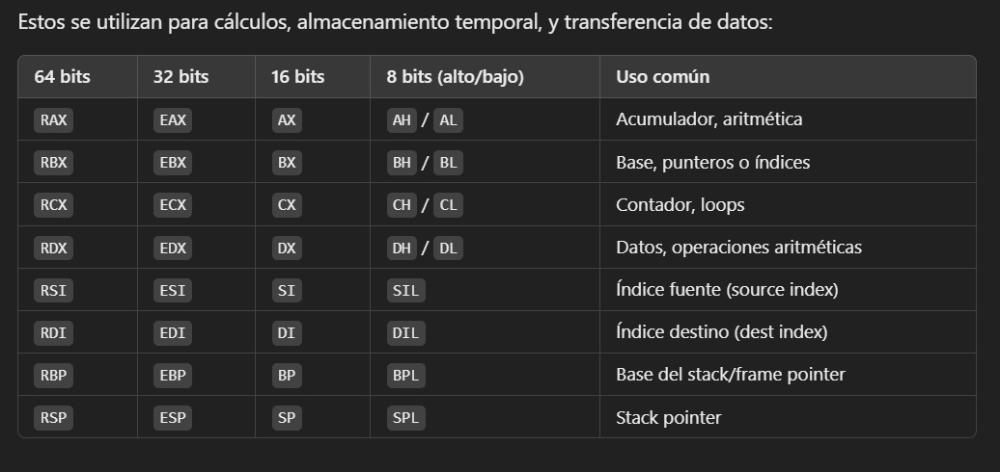

# Notas

## Registros



Tambien están de R8 - R12


## Compilación y linkedición

En 32 bits:

````bash
nasm -f elf32 file.asm
ld -m elf_i386 file.o
````

En 64:

````bash
nasm -f elf64 file.asm 
ld -m elf_x86_64 file.o
````

## Codigo típico