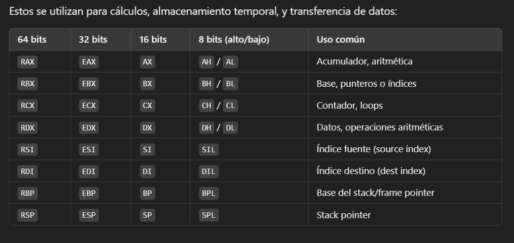
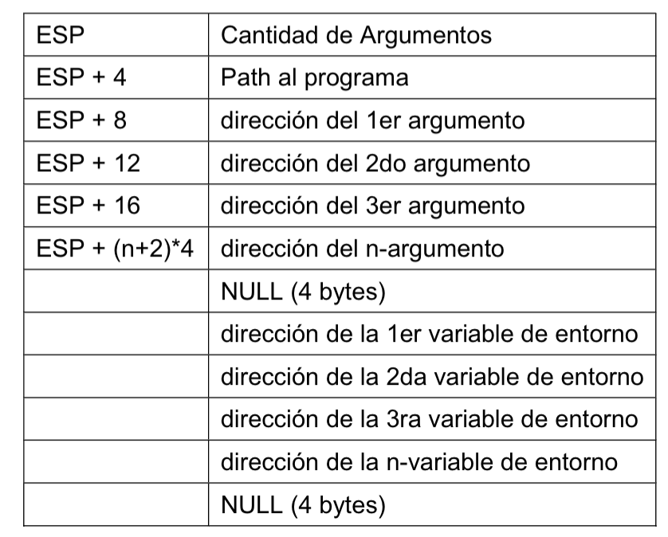
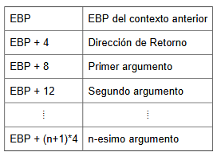

# Assembly y C

TODAS LAS DIRECCIONES DE MEMORIA OCUPAN 1 BYTE

## Registros



Tambien están de R8 - R12


## Stack

cuando se monta un programa con ld:



con gcc:
(despues de el armado del stack frame)



las direcciones que estan mas abajo son mayores

## Compilación y linkedición

### Compilación

asm 32 y 64:
````bash
nasm -f elf32 file.asm

nasm -f elf64 file.asm 
````

c en 32:
* -c para que solo compile y genere el .o
* -m32 para que lo haga en 32 bits

````bash
gcc -c -m32 file.c
````

### Linkedición

ld en 32 y 64:

busca la etiqueta _start para ejecutar
````bash
ld -m elf_i386 file.o

ld -m elf_x86_64 file.o
````


gcc en 32:

el gcc siempre busca la etiqueta main para ejecutar
````bash
gcc -m32 file1.o file2.o
````

### Generar salida en asm a partir de c:

```bash
gcc -c file.c -m32 -fno-dwarf2-cfi-asm -fno-exceptions -S -fno-asynchronous-unwind-tables -masm=intel
```


## Syscalls

[Linux Syscall Reference](https://web.archive.org/web/20180806043517/http://syscalls.kernelgrok.com/)

## Boiler plate code

### Codigo para empezar un programa

si linkeditamos con ld:

```asm
GLOBAL _start

section .text

_start:

    mov eax, 1		; ID del Syscall EXIT
	mov ebx, 0		; Valor de Retorno
	int 80h		    ; Ejecucion de la llamada

section .data


section .bss
```

si linkeditamos con gcc:
```asm

GLOBAL main

section .text

main:

    mov eax, 1		; ID del Syscall EXIT
	mov ebx, 0		; Valor de Retorno
	int 80h		    ; Ejecucion de la llamada

section .rodata


section .bss
```

### Codigo para imprimir en pantalla
```asm
    mov ecx, cadena 	    ; Puntero a la cadena
	mov edx, longitud		; Largo de la cadena 
	mov ebx, 1		    	; FileDescriptor (STDOUT)
	mov eax, 4		    	; ID del Syscall WRITE
	int 80h		        	; Ejecucion de la llamada
```

### Armado del stack frame
```asm
	push ebp
	mov ebp,esp
	and esp, -16	; alinea a 4 bits
	...
	mov esp,ebp
	pop ebp
	ret
```


### Llamado a funciones de C en 32 bits
```asm
	;Ejemplo: fun(arg1, arg2)

	push arg2
	push arg1
	call fun
	add esp 4*2 	;4*(#args)
```


## Convenciones de C

* Las funciones arman siempre el stack frame
* Los valores de retorno en 32 bits van:
  * en eax si entra en 32 bits
  * en EDX:EAX si no entra en 32 pero si en 64
  * en EDX:EAX el puntero a la estructura si no entra en 64
* En 32 bits se pushean los argumentos de las funciones de derecha a izqiuerda
* En 64 primero llena registros y luego si no alcanza guarda en el stack en el siguiente orden:
	1. RDI
	2. RSI
	3. RDX
	4. RCX
	5. R8
	6. R9
* Los registros que las funciones deben preservar son:
  * EBX
  * ESI
  * EDI
  * EBP
  * ESP


## Canary en el Stack

El **canary** es un valor especial que se coloca en el stack entre las variables locales y la dirección de retorno de una función. Su propósito es detectar si se ha producido un desbordamiento de buffer que podría sobrescribir la dirección de retorno.

### Funcionamiento:
1. **Inicialización**: 
   - Al entrar en una función, se coloca un valor conocido (el canary) en el stack.
   - Este valor suele ser aleatorio o una constante difícil de predecir.

2. **Protección**:
   - Si ocurre un desbordamiento de buffer, es probable que el canary sea sobrescrito antes de que se alcance la dirección de retorno.

3. **Verificación**:
   - Antes de que la función retorne, se verifica si el valor del canary sigue intacto.
   - Si el valor ha cambiado, el programa detecta el desbordamiento y toma medidas, como abortar la ejecución.

### Ejemplo gráfico:
```
|   Variables locales  |
|----------------------|
|       Canary         | 
|----------------------|
|         ebp          | 
|----------------------|
| Dirección de retorno |
```

### Ventajas:
- Ayuda a prevenir ataques como el **stack smashing**.
- Es una técnica común en compiladores modernos con protección de stack habilitada (e.g., `-fstack-protector` en GCC).

### Limitaciones:
- No protege contra todos los tipos de vulnerabilidades de memoria.
- Puede ser evitado si el atacante conoce el valor del canary.


## Tamaño de Tipos de Datos

| Tipo de Dato        | Tamaño (32-bit) | Tamaño (64-bit) | Notas                                     |
| :------------------ | :-------------- | :-------------- | :---------------------------------------- |
| **INTEGER**         |                 |                 |                                           |
| `char`              | 1 byte          | 1 byte          |                                           |
| `short`             | 2 bytes         | 2 bytes         |                                           |
| `int`               | 4 bytes         | 4 bytes         |                                           |
| `long`              | 4 bytes         | 8 bytes         | Varía según el modelo de datos (LP64)     |
| `long long`         | 8 bytes         | 8 bytes         |                                           |
| `Pointer`           | 4 bytes         | 8 bytes         |                                           |
| **SSE**             |                 |                 |                                           |
| `float`             | 4 bytes         | 4 bytes         | Generalmente manejado por FPU/SSE         |
| `double`            | 8 bytes         | 8 bytes         | Generalmente manejado por FPU/SSE         |
| **MEMORY**          |                 |                 |                                           |
| Datos > 8 bytes     | En memoria      | En memoria      | Estructuras, arrays grandes, etc.         |
| Datos desalineados  | En memoria      | En memoria      | Puede requerir múltiples accesos a memoria |

**Nota:** Los tamaños pueden variar ligeramente dependiendo del compilador específico y el modelo de datos utilizado (e.g., ILP32, LP64). La tabla muestra los tamaños más comunes para arquitecturas x86/x86-64 con GCC/Clang en Linux.
